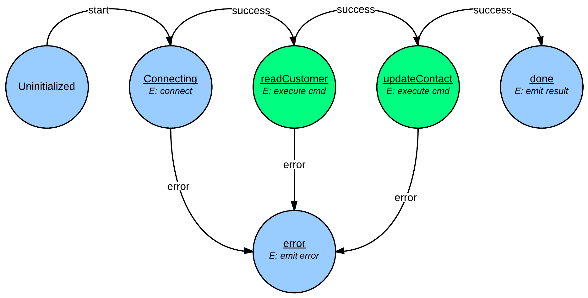
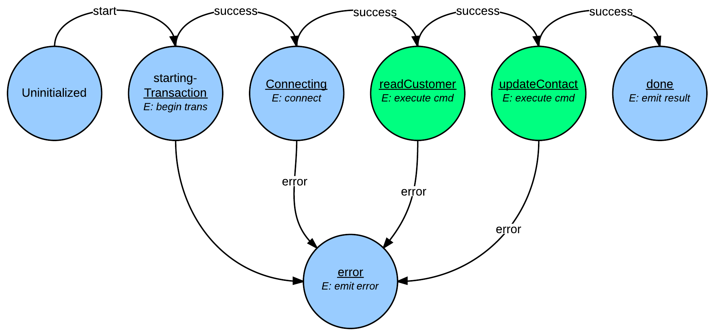

#Seriate
=========

A cross platform node module for Microsoft SQL Server based on [node-mssql](https://www.npmjs.org/package/mssql)

##API

The follow methods are exposed on the module:

|method name         | description              |
|--------------------|--------------------------|
|`getPlainContext([connectionConfig])` | returns transaction-less database context.
|`getTransactionContext([connectionConfig])` | returns a context associating *one* transaction with a connection.
|`executeTransaction([connectionConfig,] queryOptions)` | shortcut method to execute *one* command on a transaction context
|`execute([connectionConfig,] queryOptions)` | shortcut method to execute *one* command on a plain (transaction-less) context.
|`first([connectionConfig,] queryOptions)` | shortcut method that returns only the first row of a result set (calls `execute` under the hood)
|`fromFile(path)` | Allows you to read a `.sql` file instead of in-lining your SQL in your JavaScript.
|`setDefaultConfig(config)` | Allows you to store database connection info/creds. Subsequent calls to methods that take `connectionConfig` arguments will use the default config if nothing is passed in.

> NOTE: The `connectionConfig` argument is only optional above if you've specified a default configuration by calling `setDefaultConfig`.

Sql type constants are exposed in both Pascal Case and all capitals off of the library. See the listing at the end of this document.

###getPlainContext(connectionConfig)

An example `connectionConfig` using SQL authentication looks like this:

```javascript
{
	"server": "127.0.0.1",
	"user": "nodejs",
	"password": "mypassword",
	"database": "master",
	"pool": {
		"max": 10,
		"min": 4,
		"idleTimeoutMillis": 30000
	}
}
```

An example `connectionConfig` using Trusted/NTLM authentication looks like this:

```javascript
{
	"server": "127.0.0.1",
	"user": "windowsUser",
	"password": "windowsUserPassword",
	"database": "master",
	"domain": "yourDomain", // should be machine name if the server is not in an AD domain
	"pool": {
		"max": 10,
		"min": 4,
		"idleTimeoutMillis": 30000
	}
}
```

This method returns a `TransactionContext` instance, and allows you to add 1 or more steps to the context, with each step representing a query/command that should be executed in the database. Steps are given an `alias` (which is used to identify the result set returned), and the query details can be provided as an object (which we'll see below), or a callback that takes an `execute` continuation (which is used to process your query options argument). Let's take a look at the first approach:

####Specifying a step using just the query options object argument

Here's an example of using a plain context to read a table:

```javascript
sql.getPlainContext( {
	user: 'username',
	password: 'pwd',
	server: '127.0.0.1',
	database: 'master'
})
.step( 'readUsers', {
	query: 'select * From sys.sysusers'
	// optionally you could do this if the
	// above query were in a readUsers.sql file
	// query: sql.fromFile( 'readUsers' );
})
.end(function(sets){
	// sets has a "readUsers" property
	// which contains the results of the query
})
.error(function(err){
	console.log(err);
});
```

Note that the `SqlContext` instance returns from `getPlainContext` has a `step` method with a signature of `(alias, queryOptions)`. The possible values for a `queryOptions` argument are:

```javascript
{
	query: "plain sql query here",
	procedure: "stored procedure name to execute",
	preparedSql: "prepared SQL statement",
	params: {
		param1Name: {
			type: sql.NVARCHAR,
			val: "paramValue"
		},
		param2Name: {
			type: sql.Int,
			val: 123
		},
		param3Name: "param3Value"
	},
	multiple: false
}
```

You can only use *one* of the three sql-related fields: `query`, `procedure` or `preparedSql`. The module infers from which one you use as to how it should execute (and it's checked in that order). If you query takes params, you can provide a `params` object, where each key represents a parameter name and the value can be an object that provides the `val` and `type` (types are pulled from the `mssql` module), or the value can be a primitive value which will be passed as the paramter value. If multiple recordsets are expected from a `query` or `preparedSql`, set the `multiple` field to `true`. Multiple recordsets are automatically supported when executing a stored procedure. (NOTE: if you use multiple recordsets, your result set for a step will be an array of records sets (i.e. - nested arrays), rather than an array of a single record set).

The `end` method of a `SqlContext` instance takes a callback which receives a `sets` argument. The `sets` argument contains the dataset(s) from each step (using the step `alias` as the property name). The `error` method allows you to pass a callback that will receive an error notfication if anything fails. Note that calling `end` or `error` is what *starts* the unit of work handled by the context.

####Specifying a step using a callback that takes an `execute` continuation

Here's an example of using a plain context to read a table, and then use data from that read to determine details about the next step:

```javascript
sql.getPlainContext( {
	user: 'username',
	password: 'pwd',
	server: '127.0.0.1',
	database: 'master'
})
.step( 'readUsers', {
	query: 'select * From sys.sysusers'
})
.step( 'usersTransforms', function(execute, data) {
	// data will contain a `readUsers` property with
	// the prior step's results in an array. You can
	// use this approach with a callback to dynamically
	// determine what's fed to this step's executable
	// action. Let's pretend we fished out a particular
	// user from the readUsers step and then did this:
	var userId = getUserIdFrom(data.readUsers);
	execute({
		procedure: "GetExtendedUserInfo",
		params: {
			userid: userId
		}
	})
})
.end(function(sets){
	// sets has a "readUsers" property
	// which contains the results of the query
})
.error(function(err){
	console.log(err);
});
```

The above example shows both `step` approaches side-by-side.

###getTransactionContext(connectionConfig)
The `getTransactionContext` method returns a `TransactionContext` instance - which for the most part is nearly identical to a `SqlContext` instance - however, a transaction is started as the context begins its work, and you have the option to commit or rollback in the `end` method's callback. For example:

```javascript
sql.getTransactionContext( {
	user: 'username',
	password: 'pwd',
	server: '127.0.0.1',
	database: 'master'
})
.step( 'readUsers', {
	query: 'select * From sys.sysusers'
})
.step( 'usersTransforms', function(execute, data) {
	// data will contain a `readUsers` property with
	// the prior step's results in an array. You can
	// use this approach with a callback to dynamically
	// determine what's fed to this step's executable
	// action. Let's pretend we fished out a particular
	// user from the readUsers step and then did this:
	var userId = getUserIdFrom(data.readUsers);
	execute({
		procedure: "GetExtendedUserInfo",
		params: {
			userid: userId
		}
	})
})
.end(function(result){
	// the result arg contains a `sets` property
	// with all the dataset results from the steps
	// in this context, but it also contains a transaction
	// member that contains a `commit` and `rollback` method.
	// Calling either commit or rollback returns a promise
	// and will also cause the underlying connection to be
	// closed for you afterwards.
	result.transaction
		.commit()
		.then(function() {
			console.log("Yay, we're not afraid of commitment...");
		}, function(err){
			console.log("O NOES! An error");
		});
})
.error(function(err){
	console.log(err);
});
```

You can see that the main difference between a `SqlContext` and `TransactionContext` is that the argument passed to the `end` callback contains more than just the `sets` (data sets) in the `TransactionContext`. A `TransactionContext` does not automatically call `commit` for you - that's in your hands (for now). However, if an error occurs, it will call `rollback` and then close the connection.

###executeTransaction(connectionConfig, queryOptions)
This is a shortcut method to getting a `TransactionContext` instance to execute one step. It returns a promise, and the `result` argument that's normally fed to the `end` method's callback is passed to the success handler of the promise, and any errors are passed to the error handler. For example:

```javascript
sql.executeTransaction( config, {
	procedure: "UpdateCustomer",
	params: {
		customerid: {
			val: id,
			type: sql.INT
		},
		balance: {
			val: 45334,
			type: sql.MONEY
		}
	}
} ).then( function( data ) {
	// you can choose to commit or rollback here
	// data.result is your result set
	// data also contains a transaction prop
	// with commit/rollback methods
	return data.transaction
		.commit()
		.then(function(){
			console.log("Updated customer balance....")
		});
}, function( err ) {
	console.log( err );
} );
```


###execute(connectionConfig, queryOptions)
This is a shortcut method to getting a `SqlContext` instance to execute one step. It returns a promise, and the query result is passed to the success handler of the promise, and any errors are passed to the error handler. For example:

```javascript
sql.execute( config, {
	preparedSql: "select * from someTable where id = @id",
	params: {
		id: {
			val: 123,
			type: sql.INT
		}
	}
} ).then( function( data ) {
	//data is the query result set
}, function( err ) {
	console.log( err );
} );
```

##So How Does This Work?
Read this far, eh? Great - now we can talk about how it works under the hood.

###Contexts as Acceptor-style FSMs
The `SqlContext` constructor function is derived from `machina.Fsm` (the constructor function used to create a finite state machine in the [`machina`](https://github.com/ifandelse/machina.js) library). `SqlContext` starts with only the following states: `uninitialized`, `connecting`, `done` and `error`. The FSM loosely acts as an acceptor-style FSM - with each step resulting in either a success or error result, determining if it continues on to the eventual `done` state, or lands in `error`.

###Adding Steps -> Adding States to the FSM
When you use the `step` call to add a step to the context, the `alias` you provide becomes a new state name which is added to the underlying FSM, and the action you specify via the `queryOptions` argument (or the alternative syntax using the callback that takes the `execute` continuation), becomes the entry action for this new state. Success and error input handlers are also added to this state, and are triggered based on the results of the call to the database that occurs in the entry action. The new state names you add are queued up in a `pipeline` array, so that the order in which you added them can be maintained once the FSM begins executing.

###Starting Execution
Once you've added the steps you want executed as part of the unit of work, you have to use the `end` or `error` calls to start execution. Under the hood, calling either `end` or `error` results in the FSM being told to handle a `start` input. Let's pretend you have a `SqlContext`, and you've added two steps to it: `readCustomer` and `updateContact`. The FSM starts in the uninitialized state, and once it receives the `start` input, proceeds to the `connecting` state where it opens a connection to the database. Assuming a successful connection, it then proceeds to the `readUsers` state added by our first step. Again, assuming success, the next state would be `updateContact`, and finally the `done` state. As the FSM enters the `done` state, it emits the result to the callback passed to `end`. If any state encounters an error along the way, it transitions to the `error` state. Upon entering the `error` state, the FSM emits the error to the callback passed to `error`. Here's a directed graph showing the scenario I just described (the states that are always part of the FSM are in blue, and the ones added by the :



###TransactionContext Flow
The `TransactionContext` is mostly identical to the SqlContext, except that it has an extra state after `connecting` - the `startingTransaction` state. Here's the same scenario we described above in a `TransactionContext`:



##Getting Set Up/Testing/etc.

* You'll need to run `npm install` at the root of this project once you clone it to install the dependencies.
* To run unit tests: `npm test`
* To run integration tests: `npm run intspec`
* To run the example module: `npm run example`

*Please* note that in order to run the integration tests, you will need to create a `local-config.json` file in the `spec/integration` directory, matching something similar to this:

```javascript
{
	"server": "10.0.1.16",
	"user": "username",
	"password": "pwd",
	"database": "master",
	"pool": {
		"max": 10,
		"min": 2,
		"idleTimeoutMillis": 30000
	}
}
```

## Sql Constants
Pascal and Upper case properties:
```javascript
VarChar 				VARCHAR
NVarChar 				NVARCHAR
Text 					TEXT
Int 					INT
BigInt 					BIGINT
TinyInt					TINYINT
SmallInt 				SMALLINT
Bit 					BIT
Float 					FLOAT
Numeric 				NUMERIC
Decimal 				DECIMAL
Real 					REAL
Date 					DATE
DateTime 				DATETIME
DateTime2 				DATETIME2
DateTimeOffset 			DATETIMEOFFSET
SmallDateTime 			SMALLDATETIME
Time 					TIME
UniqueIdentifier 		UNIQUEIDENTIFIER
SmallMoney 				SMALLMONEY
Money 					MONEY
Binary 					BINARY
VarBinary				VARBINARY
Image					IMAGE
Xml 					XML
Char 					CHAR
NChar 					NCHAR
NText					NTEXT
						TVP
						UDT
Geography				GEOGRAPHY
Geometry				GEOMETRY
```
